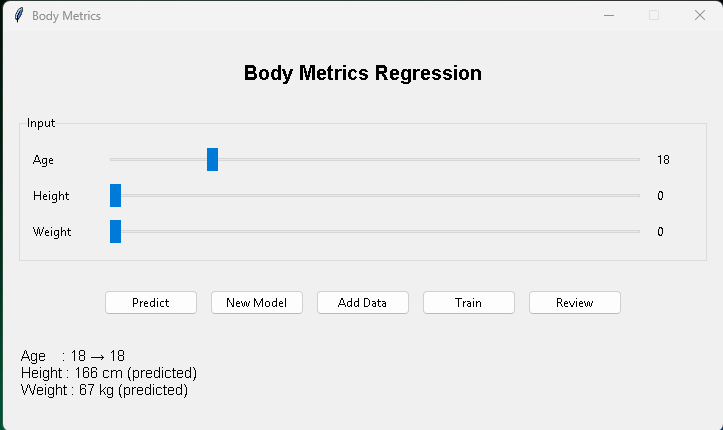

# BodyMetrics Regression System

**BodyMetrics Regression System** is an advanced AI-driven application designed to model and predict the complex relationships between human age, height, and weight. Unlike standard linear models, this system uses a multi-directional neural network to estimate missing physical metrics based on available data.

The core of this project is powered by the **ZevihaNut/3.0** neural network architecture, part of the [aertsimon90/Zevihanthosa](https://www.google.com/search?q=https://github.com/aertsimon90/Zevihanthosa) framework.

---

## 🚀 Key Features

* **Multi-directional Prediction:** The model doesn't just predict  from . It understands the correlation between all three variables. For example, if you provide only age, it predicts height and weight; if you provide height and weight, it can estimate age.
* **Powered by Zevihanthosa:** Leverages a custom-built `Brain` structure instead of traditional heavy frameworks, allowing for lightweight yet powerful regression.
* **Hybrid Interface:** * **GUI (Graphical User Interface):** Built with Tkinter for interactive sliding scales and real-time visualization.
* **CLI (Command Line Interface):** Robust terminal support for automated training, data entry, and quick predictions.



* **Visual Regression Analysis:** Integrated Matplotlib "Review" feature to visualize how well the AI line fits the training data points.

---

## 🛠️ Technical Architecture

The system normalizes all inputs to a range between  and  before processing. The default neural configuration is:

* **Input/Output:** 3 Neurons (Age, Height, Weight)
* **Hidden Layers (Lobes):** `[[3, 12], [12, 3]]` (Mapping 3 inputs to a 12-neuron hidden layer, then back to 3 outputs).
* **Advanced Learning:** Utilizes momentum (`momentumexc`) and natural derivatives to prevent the model from getting stuck in local minima during training.


---

## 📦 Installation

1. Ensure you have the `zevihanthosa` library installed in your Python environment.
2. Install the necessary dependencies:
```bash
pip install matplotlib numpy

```


3. Clone the repository and run the application:
```bash
python main.py

```


---

## 🖥️ Usage Guide

### Graphical User Interface (GUI)

Simply run the script without arguments to launch the dashboard:

* **Predict:** Adjust sliders. If a value is set to 0, the AI treats it as the "unknown" variable to be predicted.
* **Train:** Open the training window to run additional epochs on the current dataset.
* **Review:** Generates a statistical plot comparing the AI's prediction curve against actual data points to calculate the "Overall Accuracy."

### Command Line Interface (CLI)

Use the terminal for quick operations:

* **Create a New Model:**
```bash
python main.py new --learning=0.01 --maxage=120 --pretrainepoch=50

```


* **Add Custom Data:**
```bash
python main.py add 25 180 75

```


* **Quick Prediction:**
```bash
python main.py guess 20 175 0

```


---

## 📊 Performance Analysis

The "Review" module calculates the **Mean Deviation Percentage**. By comparing the AI's guesses for every point in the training set against the actual values, it provides a transparency metric for the model's reliability.

---

## 📜 License

Distributed under the MIT License. See `LICENSE` for more information.

---

*Predicting the human form, one epoch at a time.* 🚀
