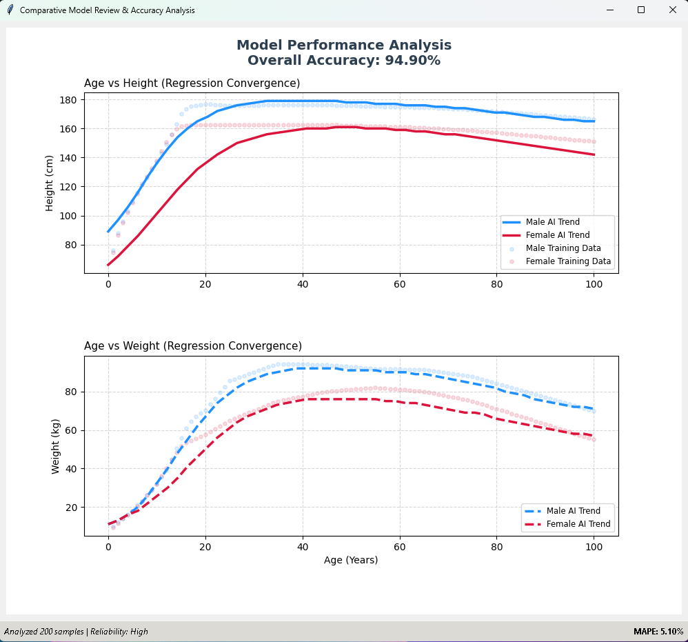

# BodyMetrics Regression System

**BodyMetrics Regression System** is an advanced AI-driven application designed to model and predict the complex relationships between human age, height, and weight, now featuring **gender-specific biometric modeling**. Unlike standard linear models, this system uses a multi-directional neural network to estimate missing physical metrics based on available data.

The core of this project is powered by the **ZevihaNut/3.0** neural network architecture, part of the [aertsimon90/Zevihanthosa](https://github.com/aertsimon90/Zevihanthosa) framework.

---

## 🚀 Key Features

* **Gender-Aware Biometrics:** The system utilizes three distinct neural networks: a **Male Model**, a **Female Model**, and a **Gender Classifier**.
* **Multi-directional Prediction:** The model doesn't just predict from age. It understands the correlation between all variables. If you provide only age, it predicts height and weight; if you provide height and weight, it can estimate age and gender.
* **Powered by Zevihanthosa:** Leverages a custom-built `Brain` structure instead of traditional heavy frameworks, allowing for lightweight yet powerful regression.
* **Hybrid Interface:**
* **GUI (Graphical User Interface):** Built with Tkinter for interactive sliding scales, real-time visualization, and gender toggles.
* **CLI (Command Line Interface):** Robust terminal support for automated training, data entry, and quick predictions.


* **Visual Regression Analysis:** Integrated Matplotlib "Review" feature to visualize how well the AI line fits the training data points for both genders simultaneously.


---

## 🛠️ Technical Architecture

The system normalizes all inputs to a range between **0.0** and **1.0** before processing. The architecture uses a specialized "Multi-Brain" logic:

* **The Gender Brain:** Classifies the input as Male (0.0) or Female (1.0).
* **The Biometric Brains:** Two separate `[[3, 12], [12, 3]]` networks trained specifically on male and female growth curves.


* **Autoencoder Logic:** During training, the system trains on every permutation of input (Age only, Height+Weight, etc.) to allow the model to "fill in the blanks" regardless of which parameter is missing.


---

## 🖥️ Usage Guide

### Graphical User Interface (GUI)

Simply run the script without arguments to launch the dashboard:

* **Predict:** Adjust sliders. If you set the Gender to **"Blank (Predict)"**, the AI will first guess the gender and then use the corresponding model to predict other metrics.
* **Train:** Open the training window to run additional epochs.
* **Review:** Generates a statistical plot comparing the Male (Blue) and Female (Red) prediction curves against actual data points to calculate the **Overall Accuracy**.

### Command Line Interface (CLI)

Use the terminal for quick operations:

* **Create a New Model:**
```bash
python main.py new --learning=0.01 --maxage=120 --pretrainepoch=50

```


* **Add Custom Data (Age, Height, Weight, Gender[0=M, 1=F]):**
```bash
python main.py add 25 180 75 0

```


* **Quick Prediction (Gender: 0, 1, or 0.5 for Auto-Detect):**
```bash
python main.py guess 20 175 0 0.5

```


---

## 📊 Performance Analysis

The "Review" module calculates the **Mean Absolute Percentage Error (MAPE)**. By comparing the AI's guesses for every point in the training set against the actual values, it generates an **Accuracy Score**:

This provides full transparency into the model's reliability across different age groups.

---

## 📜 License

Distributed under the MIT License. See `LICENSE` for more information.

---

*Predicting the human form, one epoch at a time.* 🚀
